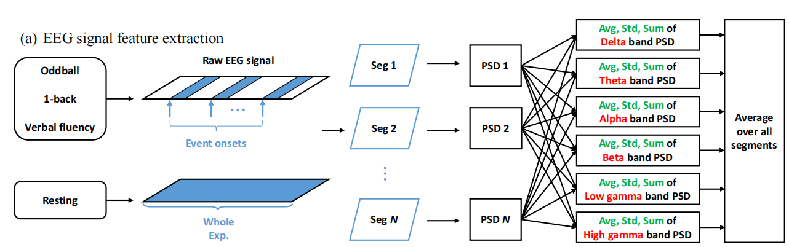
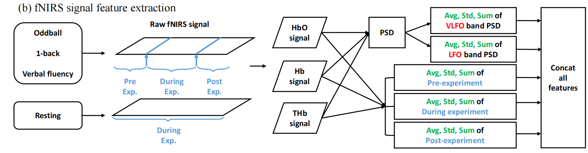

## Method Notes

### Dataset Description

- A dataset of EEG and fNIRS signals from 144 participants

#### Four Tasks

> TODO: explain what are the tasks about

- **Resting state:**
- Oddball task
- 1-back task
- Verbal fluency task

#### Details of the Signals

- EEG:

  - 32 channels

  - Sampling rate: 500 Hz

- fNIRS:
  - 6 channels
  - Sampling rate: 8 Hz
  - Three signals were derived from each signal: HbO, Hb, THb=HbO+Hb

### Data Preprocessing

- **5th-order Butterworth band-pass filter** for all the signals

- The raw EEG signals filtered in the range of 1-40 Hz

- The raw fNIRS filtered within 0.01-0.15 Hz

- **Baseline corrections** on three cognitive tasks (oddball, 1-back, and verbal fluency)

  I.e., deduct the average signal intensity during a 30-second resting interval preceding the initiation of each task

  > TODO: make clear why to do so

### Feature Extraction

#### EEG signal feature extraction

- There are specific *events* in each task

- Therefore, segment the EEG signals by the time that each *event* occurs
  - Each segment are 30 seconds long
  - For resting task, the entire 60 seconds signal is treated as a single segment due to the absence of an event.
- These segments are used for feature extraction, not the entire signal

> **PSD (Power Spectral Density, W/Hz or dB/Hz):** for a certain segmented signal $x(t)$, let $X(f)$ be its Fourier transform: then the PSD of the signal is
> $$
> P(f)=|X(f)|^2
> $$

- Extract related features per frequency band from EEG signals by adopting PSD.

  - Welch's method is applied for calculating PSD

  > TODO: more details in calculation

#### fNIRs feature extraction

Unlike EEG, which directly measures the brain's electrical activity, fNIRS <u>indirectly measures brain activity through changes in cerebral blood flow</u>, causing a **delay** in detection.

- Each hemoglobin signal (HbO, Hb, THb) is split into three parts:
  - 30-second resting period before the task (Pre-Exp.)
  - The entire task duration (During-Exp.)
  - 30-second rest period after the end of the task (Post-Exp.)
- Calculate statistical features in the time domain:
  - Average, standard deviation, and the sum of the raw signal of each part
  - For resting tasks: utilize the entire signal for the extraction of time domain features

- Frequency domain analysis using PSD:
  - 